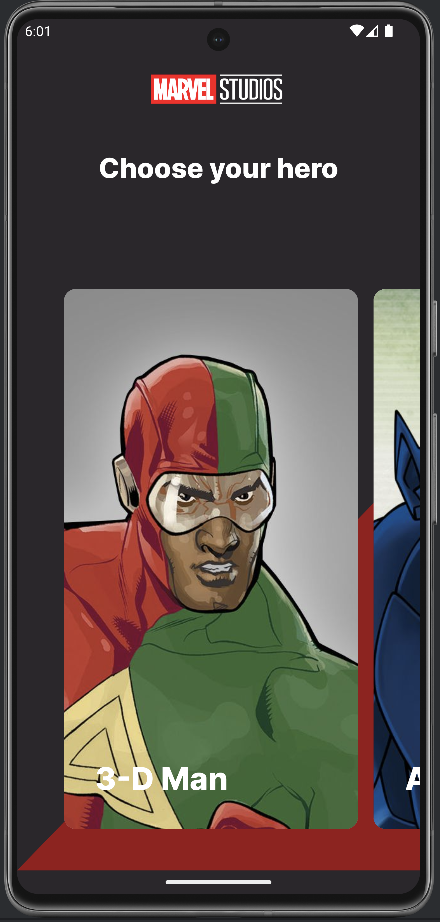
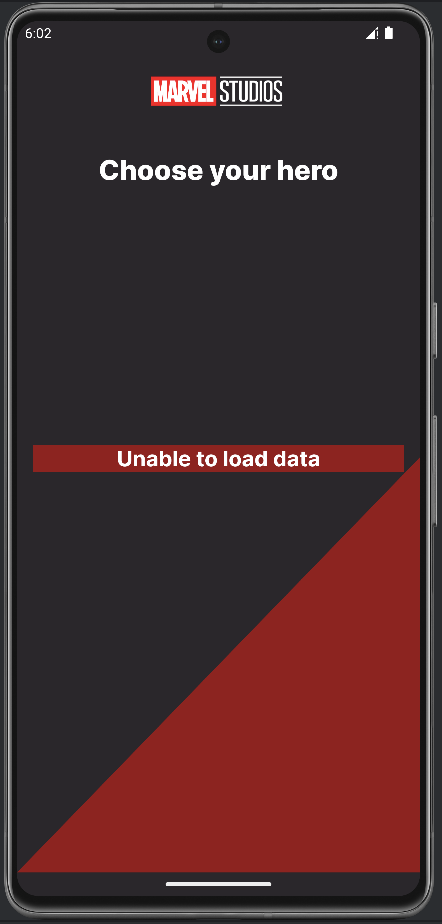
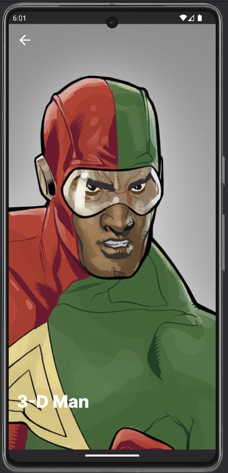
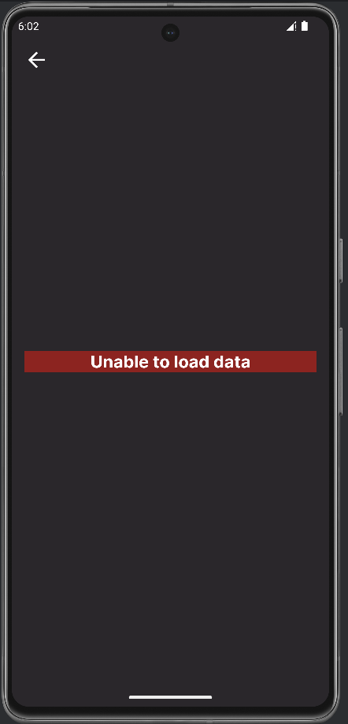

# Marvel app for Effective course. Lab №2, Android.

## How to run

* Clone this project
* Run Android Studio (at least Giraffe)
* Add Public key and Private key in "apikey.properties" file
You can get them here: https://developer.marvel.com/
* Tap button "Run 'app'"

## STACK

* Jetpack Compose 
* Gradle
* Coil
* Retrofit
* Moshi

## Screenshots app
|                        Screens                         |                         Errors                         |
|:------------------------------------------------------:|:------------------------------------------------------:|
|   |   | 
|  |  | 

# APK

* [APK](assets/app-debug.apk)